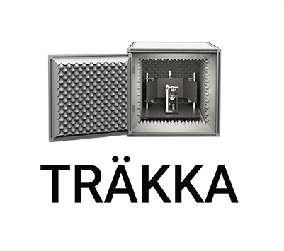
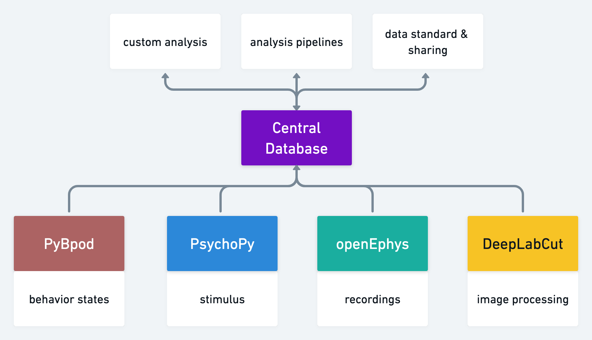
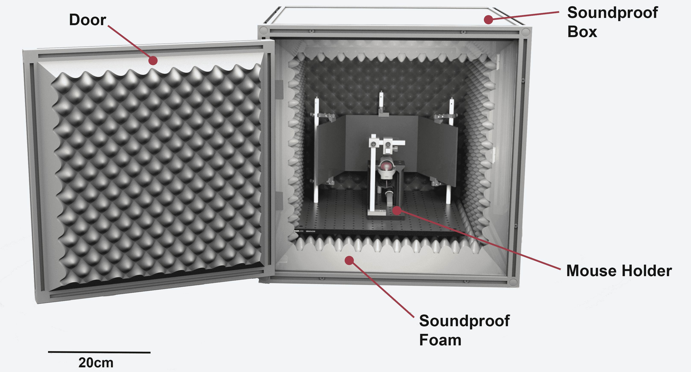
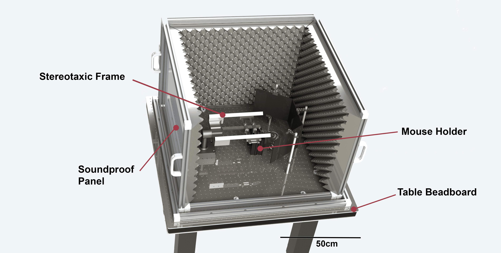
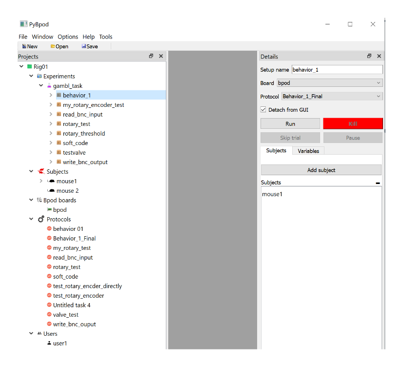
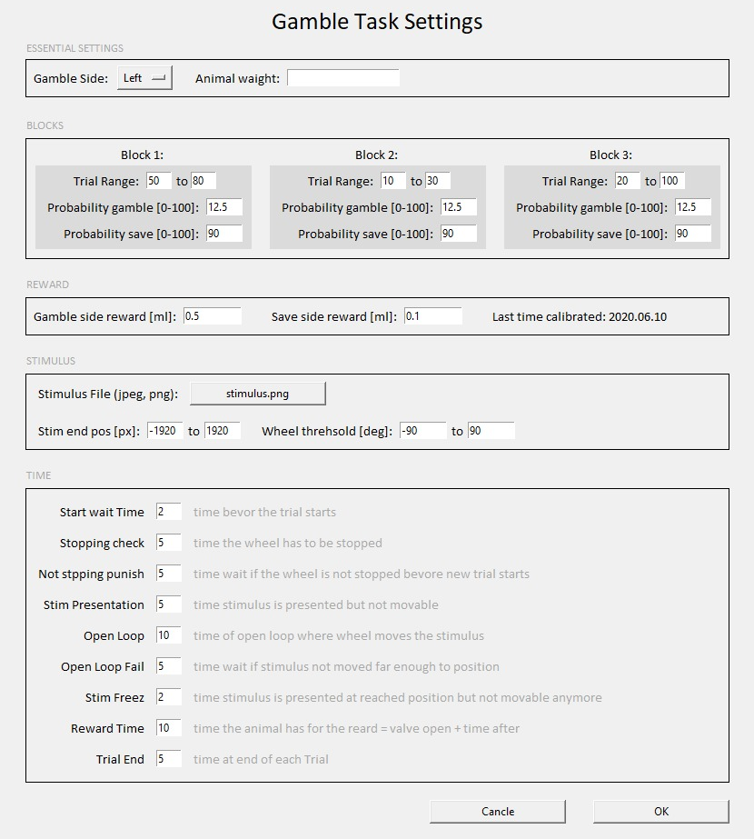

<h1 align="center">
  <a href="https://github.com/maxhoheiser/maxland">
    <!-- Please provide path to your logo here -->
    
  </a>
   
   
  Traekka Behavior Platform
</h1>

  Fully customizable turn key solution for behavior neuroscience
   and in-vivo electrophysiology - train record and analyze.

   

<a href="#about"><strong>Explore the screenshots »</strong></a>
 
 
<a href="https://github.com/maxhoheiser/maxland/issues/new?assignees=&labels=bug&template=01_BUG_REPORT.md&title=bug%3A+">Report a Bug</a>
·
<a href="https://github.com/maxhoheiser/maxland/issues/new?assignees=&labels=enhancement&template=02_FEATURE_REQUEST.md&title=feat%3A+">Request a Feature</a>
.
<a href="https://github.com/maxhoheiser/maxland/issues/new?assignees=&labels=question&template=04_SUPPORT_QUESTION.md&title=support%3A+">Ask a Question</a>

 

 

Table of Contents

- [About](#about)
  - [Publications](#publications)
  - [Read the docs](#read-the-docs)
  - [Built With](#built-with)
- [Getting Started](#getting-started)
  - [Prerequisites](#prerequisites)
  - [Installation](#installation)
- [Usage](#usage)
- [Support](#support)
- [Project assistance](#project-assistance)
- [Contributing](#contributing)
- [Authors & contributors](#authors--contributors)
- [License](#license)

 

---

 

## About

> **This is the software of the Traekka Behavior Platform platform for behavior neuroscience and in-vivo electrophysiology.**
>
> The system is a virtual-reality system for the behavior task, combining open-source components, with a high adoption rate throughout the in-vivo electrophysiology community, such as the Bpod state machine and the OpenEphys electrophysiology acquisition system.
>
> Furthermore, it integrates with the Traekka Database, a standardized framework for storing, analyzing, and managing data generated by the new system, based on the Neuro-Data-Without-Borders data standard and a centralized database.

 

## ⚙️ Hardware

The central brain of each individual system is a Bpod state machine from Sanworks, the latest available hardware iteration 2.3 is used. It specifically uses the Rotary Encoder Module, the Port Breakout Module, the Analog Output Module and the Audio Module.
The environment and interface between the system and the mouse is provided by a sound-proof enclosure, and fully customizable 3D printed parts.

<table><tr><td>

 

|                                    Training Box                                     |                                   Recoding System                                    |
| :---------------------------------------------------------------------------------: | :----------------------------------------------------------------------------------: |
|  |  |

</td></tr></table>

 

## 🧑‍💻 Software

<table><tr><td>

 

|                                 PyBpod Example                                 |                                User Input Example                                 |
| :----------------------------------------------------------------------------: | :-------------------------------------------------------------------------------: |
|  |  |

</td></tr></table>

 

### 📝 Publications

A detailed description of the hardware and software as well as the Gamble-Task can be found in the masters' thesis of Maximilian Hoheiser, available here: [TU Repository](https://repositum.tuwien.at/handle/20.500.12708/17377)

### Built With

> **[?]**
> Please provide the technologies that are used in the project.

 

## Getting Started

### Prerequisites

> **[?]**
> What are the project requirements/dependencies?

 

### Installation

> **[?]**
> Describe how to install and get started with the project.

 

## Usage

> **[?]**
> How does one go about using it?
> Provide various use cases and code examples here.

 

## Roadmap

See the [open issues](https://github.com/maxhoheiser/maxland/issues) for a list of proposed features (and known issues).

- [Top Feature Requests](https://github.com/maxhoheiser/maxland/issues?q=label%3Aenhancement+is%3Aopen+sort%3Areactions-%2B1-desc) (Add your votes using the 👍 reaction)
- [Top Bugs](https://github.com/maxhoheiser/maxland/issues?q=is%3Aissue+is%3Aopen+label%3Abug+sort%3Areactions-%2B1-desc) (Add your votes using the 👍 reaction)
- [Newest Bugs](https://github.com/maxhoheiser/maxland/issues?q=is%3Aopen+is%3Aissue+label%3Abug)

 

## Support

> **[?]**
> Provide additional ways to contact the project maintainer/maintainers.

Reach out to the maintainer at one of the following places:

- [GitHub issues](https://github.com/maxhoheiser/maxland/issues/new?assignees=&labels=question&template=04_SUPPORT_QUESTION.md&title=support%3A+)
- Contact options listed on [this GitHub profile](https://github.com/maxhoheiser)

 

## Project assistance

If you want to say **thank you** or/and support active development of Traekka Behavior Platform:

- Add a [GitHub Star](https://github.com/maxhoheiser/maxland) to the project.
- Tweet about the Traekka Behavior Platform.
- Write interesting articles about the project on [Dev.to](https://dev.to/), [Medium](https://medium.com/) or your personal blog.

Together, we can make Traekka Behavior Platform **better**!

 

## Contributing

First off, thanks for taking the time to contribute! Contributions are what make the open-source community such an amazing place to learn, inspire, and create. Any contributions you make will benefit everybody else and are **greatly appreciated**.

Please read [our contribution guidelines](docs/CONTRIBUTING.md), and thank you for being involved!

 

## Authors & contributors

The original setup of this repository is by [Maximilian Hoheiser](https://github.com/maxhoheiser).

For a full list of all authors and contributors, see [the contributors page](https://github.com/maxhoheiser/maxland/contributors).

 

## License

This project is licensed under the **MIT license**.

See [LICENSE](LICENSE) for more information.
